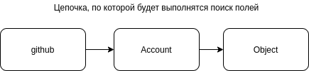

# Прототипы объектов

## Что за свойство __proto__ в моих объектах?

Почти каждый объект в JS имеет объект-прототип, от которого он наследует методы и свойства. Этот объект-прототип так же может иметь свой прототип и наследовать его свойства и методы. Это называют **цепочкой прототипов** и именно благодаря ей объекты в JS имеют возможность наследовать свойства и методы, определенные в других объектах.

[filename](prototypes.js ':include :type=code :fragment=simple-example')

В данном примере у нашего объекта нет метода valueOf, но он есть у прототипа, от которого он унаследован: `Object`.

1. Сначала движок проверяет, есть ли в объекте `githubAccount` доступный метод `valueOf()`

2. Если метод не найден, движок переходит по цепочке прототипов на уровень выше. Прототипом нашего объекта является `Object`, у которого доступен метод `valueOf()`. Он и будет вызван.

Т.е. методы и свойства не копируются в дочерние объекты, а ищутся в прототипах их родителей.

В нашей функции свойство prototype создается автоматически, чтобы её можно было использовать как конструктор. Свойство prototype не имеет отношения к прототипу конструктора, а задает прототипы дочерних объектов. Попробуем его изменить:

[filename](prototypes.js ':include :type=code :fragment=prototype-modification')

Почему в начале было сказано "Почти каждый объект"? Потому что мы можем создает объект без прототипа насильно, используя `Object.create(null)`:

[filename](prototypes.js ':include :type=code :fragment=empty-object')

Объект, создаваемый таким способом не будет иметь лишних свойств, унаследованных от `Object`. 

## Наследование

Мы можем установить свойство `prototype` нашему конструктору или установить `__proto__` одному из дочерних объектов. Чтобы не потерять свойство `constructor` из прототипа, его нужно будет вернуть. В конструкторе дочернего класса необходимо вызвать родительский конструктор, чтобы инициализировать его свойства и методы.

[filename](prototypes.js ':include :type=code :fragment=inheritance')

## Абстракция

Чтобы следовать принципам абстракции (выделение только самых важных общих характеристик у объектов), нам нужно создать тип, который не может быть использован как конструктор.

[filename](prototypes.js ':include :type=code :fragment=abstraction')

## Полиморфизм

Соответственно, поскольку `Cat` и `Dog` являются `instanceof Animal`, мы можем делать такую проверку чтобы убедится, что используется объект типа `Animal` или его потомок.

[filename](prototypes.js ':include :type=code :fragment=abstraction')

## util.inherits()

Для лучшей читаемости кода в Node.js до появления оффициальной реализации классов вместе с ES6 использовался метод `util.inherits`. Его реализация примерно такая:

[filename](prototypes.js ':include :type=code :fragment=util-inherits')

Можно воспользоваться этим методом для более простого и аккуратного наследования наших типов

[filename](prototypes.js ':include :type=code :fragment=util-inherits-use')

Вместе со стандартом ES6 в язык пришли более привычные служебные слова `class` и `extends`, позволяющие создавать новые классы с более привычным синтаксисом.
