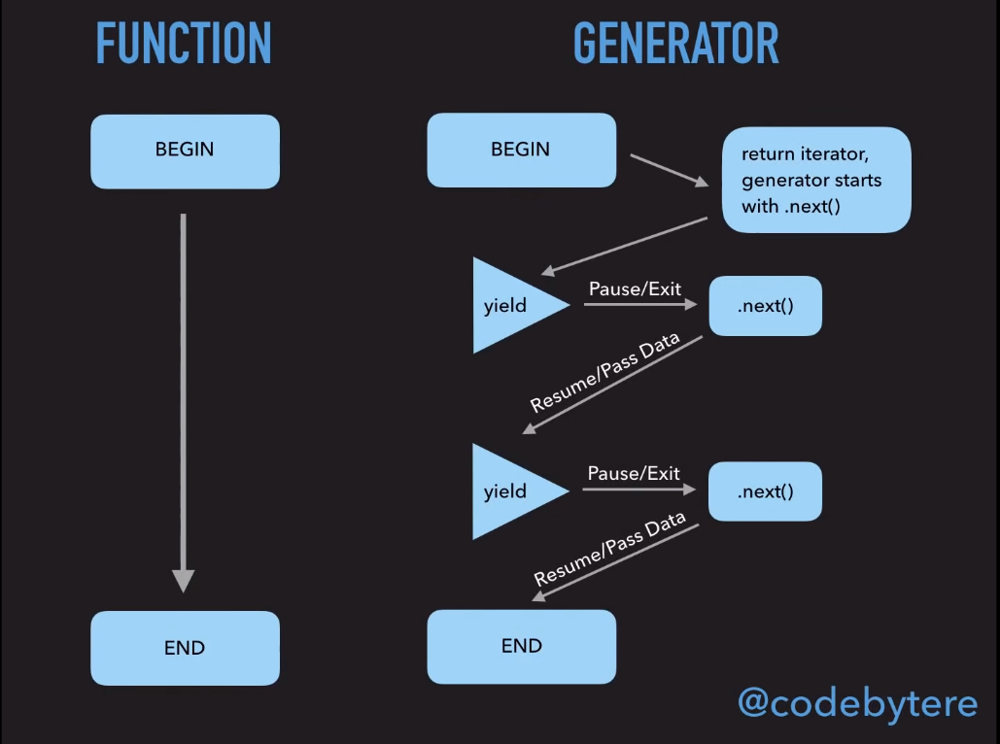

# Generators

Генераторы - специальный вид функций, которые ведут себя
**совершенно по-другому** по сравнению с обычными функциями.

## Ломаем обычные функции

Обычные функции JS, при их вызове, отрабатывают от начала до конца
и возвращают одно единственное значение.

```javascript
let x = 1;

function foo() {
	x++;
	bar();
	console.log(`value of "x" is ${x}`);
}

function bar() {
	x++;
}

foo();	
```

`console.log` никогда не выполнится раньше, чем закончится `bar()`, 
и это гарантированно стандартом (Run-to-completion). 

Блокирующий код (синхронные операции) идут сверху вниз, и ничего
не может быть вызвано "в середине выполнения функции", т.к. Event Loop
однопоточный и он "занят" выполнением этой функции.

Другими словами, вы не можете поставить выполнение обычной функции 
"на паузу", чтобы выполнить другой код.

***или можете***?

**Функции-Генераторы** - отдельный вид функций, которые могут 
"приостанавливать" свое выполнение, генерировать (возвращать) более
одного значения, передавать управление и выполнение кода "в середине"
функции, обеспечивая еще один вид асинхронности в JS.

## Объявление генератора

Ниже представлен код, который создает 3 генератора (которые ничего не делают)

```javascript
function* iAmGenerator1() {

}
function *iAmGenerator2() {

}
function*iAmGenerator3() {

}
```

Разница видна невооруженным глазом. Главное отличие - наличие звездочки
`*` между словом `function` и названием функции.

Этот символ - индикатор того, что создаваемая функция - не обычная,
а функция-генератор.

Как же она работает?

Простой (не совсем правильный) пример
```javascript
function* iAmGenerator() {
  console.log('Hey! I am generator!');
}

const gen = iAmGenerator();

console.log(gen.toString());
```

Из этого примера нам нужно уяснить 2 вещи:

1. вызов функции-генератора не запускает код внутри функции
2. функция-генератор возвращает **специальный объект** `Generator`

Что же это такое, этот объект с именем Generator?

Это очень простая (снаружи) штука. Это объект с тремя методами:


Понять лучше, что делают эти методы, легче на примерах, которые
мы рассмотрим чуть позже. А пока - давайте загляним внутрь самой функции
и посмотрим, что в них можно сделать такого, что нельзя в обычных функциях.

## Ключевое слово yield

Единственная "расширинная" функциональность генераторов - возможность
использования ключевого слова `yield`:

```javascript
function*generateSync() {
  yield 1;
  yield 2;
  yield 3;
}

const syncGenerator = generateSync();
console.log(syncGenerator.next());
console.log(syncGenerator.next());
console.log(syncGenerator.next());
console.log(syncGenerator.next());
```  

Что тут произошло?

При вызове `next()` запускается код внутри функции-генератора, который
"отрабатывает" до следующего ключевого слова `yield`. 
Значение, стоящее после `yield` запоминается, и формируется объект
вида

```json
{
  "value": <value which is after yield>,
  "done": <true of false>
}
```

т.е. функция `next` выполняет часть кода до следующего `yield` 
и возвращает объект со значением, **сгенерированным** генератором и флагом
`done`, сигнализирующим, остался ли еще какой-то код, который необходимо выполнить.


!> Если вы знакомы с итераторами, то заметите, что формат
объекта-итератора и генератора совпадают.
Это сделано специально - чтобы генераторы можно было
использовать в качестве итераторов - генерировать последовательности значений

Рассмотрим более подробный пример, но с одним `yield` и посмотрим на
произошедшую последовательность действий ([thank you, Kyle Simpson!](https://github.com/getify/You-Dont-Know-JS/blob/2nd-ed/sync-async/ch4.md#breaking-run-to-completion))

```javascript
let x = 1;

function *foo() {
	x++;
	yield; // pause!
	console.log( "x:", x );
}

function bar() {
	x++;
}

// construct an iterator `it` to control the generator
const it = foo();

// start `foo()` here!
it.next();
console.log(x);
bar();
console.log(x);
it.next();
```

1. Операция `it = foo()` НЕ выполняет код внутри функции `*foo()`, но
она создает объект-генератор который будет контролировать выполнение
функции `*foo`. 

2. Первый вызов `it.next()` начинает выполнение `*foo`, и
выполняет `x++` операцию на первой строчке `*foo`

3. `*foo` **ставится на паузу** с помощью `yield`,
на этом этапе первый вызов `it.next()` завершается.
Сама функция `*foo` не завершена, она активна, но "в состоянии паузы"

4. мы делаем какие-то действия с `x` - сейчас он равен двум

5. Мы вызываем (обычную) функцию `bar()`, которая инкрементирует `x`

6. Мы опять делаем какие-то действия с `x` (выводим в консоль)
и его значение равно 3.

7. Финальный `it.next()` вызов **возобновляет** `*foo()` генератор
с места, на котором он был приостановлен, выполняет `console.log`,
в которую переданно значение `x` 3.


Очевидно, что здесь не работает `run-to-completion` концепция
**не работает**. Наобоорт, у нас появляется возможность
вручную ставить выполнение кода на паузу даже "посередине" функции -
причем пауза ставится с помощью `yield` внутри функции,
а её выполнение продолжается с помощью вызова `.next()` снаружи.

Наглядное сравнение работы обычных функций и генераторов с картинки 
([thank you, Shelley Vohr!](https://www.youtube.com/watch?v=SrNQS8J67zc)):



**Вывод:**

Генератор - специальный вид функций, котрый могут возобновлять и 
приостанавливать выполение больше одного раза, (более того - они 
даже могу никогда не закончиться). Такой подход позволяет
генерировать большие потоки данных и/или создавать
функции, которые будут выполняться асинхронно, при этом 
выглядя синхронными.


## Входные и выходные значения

Входные аргументы функции-генератора задаются при её создании

```javascript
function *foo(x,y) {
	return x * y;
}

const gen = foo(6, 7);

const res = gen.next();

console.log(res.value);
```

"Выходные" значения - то, что стоит после `yield` (при паузе) или `return` (при полной остановке генератора).

```javascript
function *foo() {
  const input = yield 'before the first yield';
  console.log(input);
}

const gen = foo();
const res = gen.next();
console.log(res.value);
gen.next("input from outside");
```

1. Создан генератор `foo`
2. Вызван первый `gen.next()`. Выполняется код до первого `yield`.
Т.к. строчка `'before the first yield'` стоит справа от оператора
`yield`, она резолвится ДО `yield` и сохраняется в `value` объекта,
который вернулся из первого `gen.next()`. Первый `gen.next()` 
завершает работу.
3. Запускается второй `gen.next('input from outside')` - 
строка `input from outside` становится
"результатом выполнения" первого `yield` и "встает на его место"
4. в переменную `input` записано значение `input from outside` и выведено в консоль


Чтобы было проще понять, как сработал `yield` и в какой последовательности
отработали операторы, можно "переиначить" код как:

```javascript

function getOneStringAndReturnAnother(str) {
    console.log(str);
    return "input from outside";
}

function foo() {
    const input = getOneStringAndReturnAnother("before the first yield");
    console.log(input);
}
```

Код выше - **это НЕ равнозначная замена примеру на генераторах**,
но он показывает моменты "изменения". Если проводить
аналогию, то:

* то, что подается внутрь функции `getOneStringAndReturnAnother` - отрабатывает во время первого `it.next`
* то, что работает внутри функции `getOneStringAndReturnAnother` - работает вне функции-генератора
* то, что работает после функции `getOneStringAndReturnAnother` - работает во время второго `it.next()`

## throw и return

Можно даже кидать ошибки "внутрь" генератора снаружи:

```javascript
function *foo() {
  try {
    const input = yield 'before the first yield';
    console.log(input);
  } catch (error) {
    console.log(`Error!: ${error}`);
  }
}

const gen = foo();
const res = gen.next();
console.log(res.value);
gen.throw(new Error('hey, I am error from outside'));
```

И принудительно завершать выполнение генератора:

```javascript
function *foo() {
  console.log('line 1');
  try {
    const input = yield 'before the first yield';
    console.log(input);
  } catch (error) {
    console.log(`Error!: ${error}`);
  }
}

const gen = foo();
const res = gen.return('asdf');
console.log(res);
```

## Что делать дальше с генераторами?

Генераторы стали отличной основой для новой фичи ECMAScript - `async/await`

Также, генераторы используются для написания собственных итераторов. [Больше об этом - в интернете](https://developer.mozilla.org/ru/docs/Web/JavaScript/Guide/Iterators_and_Generators)

## Links

1. [Kyle Simpson - You don't know JS - Async & Performance - ch.4 (Online book)](https://github.com/getify/You-Dont-Know-JS/blob/2nd-ed/sync-async/ch4.md)
2. [Asynchrony: Under the Hood - Shelley Vohr - JSConf EU (Youtube)](https://www.youtube.com/watch?v=SrNQS8J67zc)
3. [learn.javascript.ru - Generators (Online resource)](https://learn.javascript.ru/generators)
4. [developer.mozilla.org - Generators and iterators (Online resource)](https://developer.mozilla.org/ru/docs/Web/JavaScript/Guide/Iterators_and_Generators)
