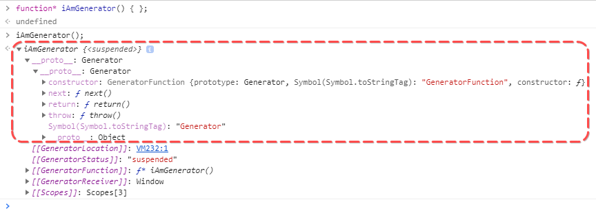

## Объявление генератора

Ниже представлен код, который создает 3 генератора (которые ничего не делают)

[filename](create_generator.js ':include :type=code :fragment=declareGenerator')

Разница видна невооруженным глазом. Главное отличие - наличие звездочки
`*` между словом `function` и названием функции.

Этот символ - индикатор того, что создаваемая функция - не обычная,
а функция-генератор.

Как же она работает?

Простой (не совсем правильный) пример

[filename](create_generator.js ':include :type=code :fragment=logGenerator')

Из этого примера нам нужно уяснить 2 вещи:

1. вызов функции-генератора не запускает код внутри функции
2. функция-генератор возвращает **специальный объект** `Generator`

Что же это такое, этот объект с именем Generator?

Это очень простая (снаружи) штука. Это объект с тремя методами:

Понять лучше, что делают эти методы, легче на примерах, которые
мы рассмотрим чуть позже. А пока - давайте загляним внутрь самой функции
и посмотрим, что в них можно сделать такого, что нельзя в обычных функциях.
