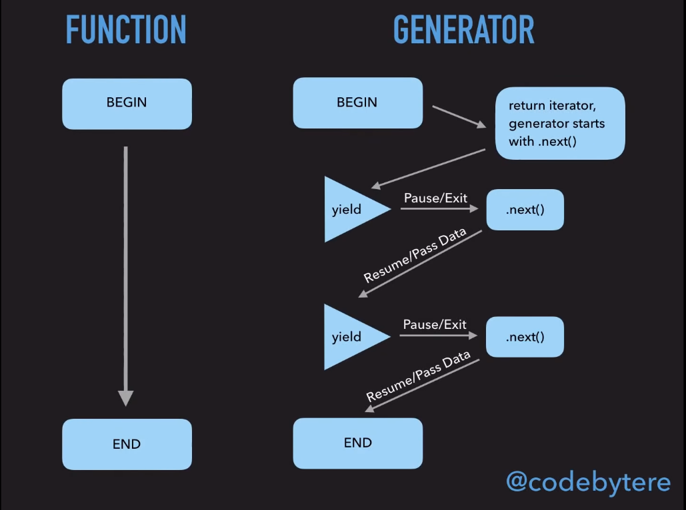

# Ключевое слово yield

Единственная "расширинная" функциональность генераторов - возможность
использования ключевого слова `yield`:

[filename](yield.js ':include :type=code :fragment=yieldAndNext') 

Что тут произошло?

При вызове `next()` запускается код внутри функции-генератора, который
"отрабатывает" до следующего ключевого слова `yield`. 
Значение, стоящее после `yield` запоминается, и формируется объект
вида

```json
{
  "value": <value which is after yield>,
  "done": <true of false>
}
```

т.е. функция `next` выполняет часть кода до следующего `yield` 
и возвращает объект со значением, **сгенерированным** генератором и флагом
`done`, сигнализирующим, остался ли еще какой-то код, который необходимо выполнить.


!> Если вы знакомы с итераторами, то заметите, что формат
объекта-итератора и генератора совпадают.
Это сделано специально - чтобы генераторы можно было
использовать в качестве итераторов - генерировать последовательности значений

Рассмотрим более подробный пример, но с одним `yield` и посмотрим на
произошедшую последовательность действий ([thank you, Kyle Simpson!](https://github.com/getify/You-Dont-Know-JS/blob/2nd-ed/sync-async/ch4.md#breaking-run-to-completion))

[filename](yield.js ':include :type=code :fragment=generatorExample')

1. Операция `it = foo()` НЕ выполняет код внутри функции `*foo()`, но
она создает объект-генератор который будет контролировать выполнение
функции `*foo`. 

2. Первый вызов `it.next()` начинает выполнение `*foo`, и
выполняет `x++` операцию на первой строчке `*foo`

3. `*foo` **ставится на паузу** с помощью `yield`,
на этом этапе первый вызов `it.next()` завершается.
Сама функция `*foo` не завершена, она активна, но "в состоянии паузы"

4. мы делаем какие-то действия с `x` - сейчас он равен двум

5. Мы вызываем (обычную) функцию `bar()`, которая инкрементирует `x`

6. Мы опять делаем какие-то действия с `x` (выводим в консоль)
и его значение равно 3.

7. Финальный `it.next()` вызов **возобновляет** `*foo()` генератор
с места, на котором он был приостановлен, выполняет `console.log`,
в которую переданно значение `x` 3.


Очевидно, что здесь не работает `run-to-completion` концепция
**не работает**. Наобоорт, у нас появляется возможность
вручную ставить выполнение кода на паузу даже "посередине" функции -
причем пауза ставится с помощью `yield` внутри функции,
а её выполнение продолжается с помощью вызова `.next()` снаружи.

Наглядное сравнение работы обычных функций и генераторов с картинки 
([thank you, Shelley Vohr!](https://www.youtube.com/watch?v=SrNQS8J67zc)):



**Вывод:**

Генератор - специальный вид функций, котрый могут возобновлять и 
приостанавливать выполение больше одного раза, (более того - они 
даже могу никогда не закончиться). Такой подход позволяет
генерировать большие потоки данных и/или создавать
функции, которые будут выполняться асинхронно, при этом 
выглядя синхронными.

